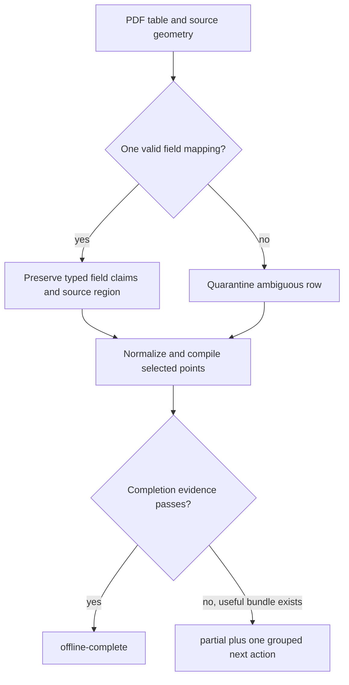

# fix: Make OEM PDF completion evidence trustworthy

## Goal Capsule

- **Objective:** Make `$compile-user-map` correct a proven shifted-column PDF layout automatically and refuse `offline-complete` when source fields or coverage do not support the output.
- **Authority:** The latest 21-document campaign and three blind runs are the behavioral evidence. `AGENTS.md` controls public-data, safety, human-time, and verification requirements.
- **Execution profile:** Test the observed failure first, make the smallest deterministic parser and compiler changes, then run focused and full repository gates.
- **Stop conditions:** Do not guess ambiguous fields, install dependencies, add a new user-facing stage, or perform live Modbus actions.
- **Tail ownership:** Ship one PR and merge only after repository and GitHub checks pass.

---

## Product Contract

### Summary

The compile workflow will preserve PDF column meaning, run one bounded internal recovery when the source uniquely supports it, and distinguish a useful partial map from a verified complete map.

### Problem Frame

The latest sandboxed campaign improved workflow completion from two of three blind runs to three of three, but one completed map changed a documented signed `int16` point with `uF` units and scale `0` into unsigned data with missing unit and scale. The workflow was fast and safe, but its completion claim was stronger than its field evidence.

The same run also showed two smaller gaps. Fresh agents could repair bounded extraction defects, but the primary compile workflow did not own that recovery directly. The maintained workflow runner does not treat a structurally valid `partial` bundle as a successful safe outcome.

### Requirements

- R1. Preserve the source meaning of address, access, datatype, unit, scale, width, and description for every recovered PDF row.
- R2. Apply a mechanical correction automatically only when table headers, source geometry, and field semantics identify one mapping.
- R3. Keep ambiguous rows as one grouped source exception while preserving unaffected rows and the three user-map files.
- R4. Keep `$compile-user-map` as the only user-visible workflow owner through bounded extraction recovery.
- R5. Permit `offline-complete` for PDF-backed maps only when discovery coverage is complete, selected points have source references and unique identities, no selected readable row is unresolved, and independently retained raw field claims do not contradict the output.
- R6. Treat a valid `partial` bundle as a useful safe campaign outcome without relabeling it complete or requiring an active decision packet.
- R7. Preserve current read-only safety, dependency limits, case hashing, idempotence, grouped holds, and target independence.

### Acceptance Examples

- AE1. Given the observed shifted grid shape, when the parser can prove one header-to-cell mapping, then the point remains `int16` with unit `uF` and numeric scale `0`, with its original source region.
- AE2. Given a row for which two mappings remain plausible, when compilation runs, then unaffected points are emitted and the ambiguous row appears in one grouped exception in a `partial` bundle.
- AE3. Given a valid useful partial bundle with no decision packet, when the workflow campaign validates it, then the case passes as `partial` and does not pass as `offline-complete`.
- AE4. Given identical source and request inputs in fresh roots, when compilation completes, then the user-map artifacts and completion evidence are deterministic and no internal stage handoff appears.

### Scope Boundaries

- Do not add a general table-inference framework, confidence score, new output artifact, new specialist skill, or new user prompt.
- Do not broaden the work to unrelated OEM table layouts without a failing synthetic fixture.
- Do not import the unmerged private OEM campaign branch. Extend the small maintained compile workflow runner on `main`.
- Never add dependency installation, live reads, writes, broadcasts, scans, or page-by-page approval.

---

## Planning Contract

### Key Technical Decisions

- KTD1. **Use one schema-aware mapping owner.** `pdf_table_extraction.py` will validate header-to-cell associations and preserve field claims before normalization. (session-settled: user-directed — chosen over a broader extraction framework: the goal is simplicity, accuracy, and speed.)
- KTD2. **Recover inside the existing intake path.** The compiler will reuse one bounded grid recovery pass and continue automatically when it yields a unique evidence-backed correction. (session-settled: user-directed — chosen over exposing specialist skills or manual page review: the outcome skill must finish safe deterministic work itself.)
- KTD3. **Separate useful from complete.** Existing `partial` and `offline-complete` states remain. A partial bundle may pass campaign safety checks, while completion requires stronger evidence. (session-settled: user-approved — chosen over blocking all output or weakening completion: the latest run showed partial artifacts are useful and false completion is unsafe.)

### Assumptions

- The maintained campaign surface for this PR is `scripts/run_compile_workflow_tests.py` plus `tests/test_compile_workflow_runner.py`; the older unmerged OEM campaign branch is not required.
- The observed shifted-column defect can be represented with a public synthetic table. No vendor row text or manual content will enter the repository.
- Existing PDF chunking, page discovery, and grid recovery remain sufficient. This work changes acceptance and validation, not extraction resource limits.
- Structured sources keep their existing completion contract. The compiler applies the stronger discovery requirement only when the OEM map's validated source reference identifies PDF input.

### High-Level Technical Design

The parser owns field association. The compiler owns outcome state. The campaign runner verifies both without adding another workflow layer.

---

## Implementation Units

### U1. Preserve PDF column semantics

- **Goal:** Correct the observed shifted-column layout without changing valid existing tables.
- **Requirements:** R1, R2, R3; covers AE1 and AE2.
- **Dependencies:** None.
- **Files:** `plugins/modbus-skills/runtime/modbus_skills/pdf_table_extraction.py`, `plugins/modbus-skills/runtime/modbus_skills/pdf_extraction.py`, `tests/test_pdf_table_extraction.py`, `tests/test_pdf_extraction.py`.
- **Approach:** Keep header detection and field assignment in one module. Validate datatype, unit, scale, access, address, and width against field-specific syntax. Accept a correction only when one mapping survives. Return accepted and quarantined grid rows as separate collections across the bounded worker boundary. Merge quarantined rows into the existing PDF envelope and coverage counts. Retain raw header, cell, page, table, row, parser, and recovery claims independently from the chosen mapping.
- **Execution note:** Start with a failing synthetic regression that reproduces the exact signed-type, unit, and zero-scale shift.
- **Patterns to follow:** Existing bounded `pdfplumber-table/v1` worker, `_claims` evidence, quarantined records, and grouped `pdf-source-coverage-unproven` hold.
- **Test scenarios:**
  - Covers AE1. A shifted synthetic row resolves to signed `int16`, `uF`, scale `0`, the correct access/address/width, and the original source region.
  - An unchanged grid table produces byte-equivalent prepared records.
  - Two plausible mappings quarantine only the ambiguous row and retain unaffected rows.
  - A syntactically valid but incorrectly shifted mapping cannot validate itself from derived claims.
  - Missing or malformed field cells never borrow a neighboring value merely because it parses as text.
- **Verification:** The parser tests prove the regression, ambiguity behavior, unchanged happy path, and retained provenance.

### U2. Gate completion on field evidence

- **Goal:** Let `$compile-user-map` recover internally and make `offline-complete` a deterministic evidence claim.
- **Requirements:** R2, R3, R4, R5, R7; covers AE2 and AE4.
- **Dependencies:** U1.
- **Files:** `plugins/modbus-skills/runtime/modbus_skills/source_intake.py`, `plugins/modbus-skills/runtime/modbus_skills/compiler.py`, `plugins/modbus-skills/runtime/modbus_skills/compiler_contracts.py`, `tests/test_compiler.py`, `tests/test_compiler_contracts.py`.
- **Approach:** Reuse the existing bounded PDF recovery during intake. Preserve a validated field-evidence collection on each OEM point for address, access, datatype, unit, scale, width, and description. Each entry retains raw header/cell values, normalized value, and source region. For PDF-backed maps, compare selected output fields to those independent claims and require a coverage receipt whose detected pages and accepted, rejected, and quarantined counts are internally consistent. Preserve `partial` output and one `provide-corrected-source` action when the gate does not pass. Leave structured-source completion unchanged.
- **Patterns to follow:** Exact input hashes, atomic case persistence, `_blocking_holds`, `source_coverage`, and current same-request idempotence.
- **Test scenarios:**
  - A uniquely corrected PDF request reaches the same final result without a stage handoff.
  - A selected field contradiction produces `partial`, all three map files, one compiler hold, and no false decision packet.
  - Missing source references, duplicate point identities, incomplete coverage, or unresolved readable rows cannot produce `offline-complete`.
  - A multi-page PDF with a register continuation page that lacks a repeated header is discovered or forces `partial`; a nonempty subset cannot prove coverage.
  - A PDF field claim derived only from the chosen normalized mapping cannot satisfy the independent comparison gate.
  - Repeating an identical request returns the persisted result without rerunning recovery or adding holds.
  - Structured-source behavior and requested target status remain unchanged.
- **Verification:** Compiler tests prove automatic continuation, strict completion, useful partial output, and idempotence.

### U3. Make campaign and skill guidance match runtime truth

- **Goal:** Test the honest state contract and explain it in plain language.
- **Requirements:** R3, R4, R5, R6, R7; covers AE3 and AE4.
- **Dependencies:** U2.
- **Files:** `scripts/run_compile_workflow_tests.py`, `tests/test_compile_workflow_runner.py`, `plugins/modbus-skills/skills/compile-user-map/SKILL.md`, `plugins/modbus-skills/skills/compile-user-map/references/request.md`.
- **Approach:** Add an expected partial case to the maintained workflow runner. Validate its artifact hashes, point counts, grouped hold, affected count, and next action without requiring an active decision packet. Strengthen the complete case to check coverage, source references, unique identities, field samples, artifact agreement, deterministic replay, elapsed budget, and absence of prohibited actions. Keep the skill copy short and distinguish “usable partial map” from “finished requested outcome.”
- **Patterns to follow:** Existing workflow scenario report, stable artifact hashes, `compile-result.json`, and the concise output-file descriptions in the skill.
- **Test scenarios:**
  - Covers AE3. A valid expected partial case passes with three map artifacts and no active packet.
  - A partial case with missing artifacts, mismatched hashes/counts, an empty affected count, or `next_action: none` fails.
  - An `offline-complete` case with a source-field mismatch or missing coverage evidence fails.
  - Fresh-root reruns produce the same maps and evidence while remaining within five minutes and invoking no network, live read, or installer path.
  - Skill validation confirms the outcome workflow keeps ownership and names one next action.
- **Verification:** Focused workflow tests and skill validators pass, and their report labels useful partial and complete outcomes separately.

---

## Verification Contract

| Gate | Applies to | Done signal |
|---|---|---|
| Focused PDF extraction tests | U1 | Shifted, unchanged, and ambiguous fixtures pass with correct field evidence. |
| Compiler and contract tests | U2 | Automatic recovery, partial output, strict completion, and idempotence pass. |
| Workflow runner and skill validation | U3 | Valid partial and complete states are distinguished and all skill metadata remains valid. |
| `python3 scripts/verify_repo.py` | U1-U3 | The complete repository gate passes. |
| GitHub PR checks | U1-U3 | All required checks are green before merge. |

---

## Definition of Done

- The synthetic regression cannot reproduce the signed-type, unit, or zero-scale corruption.
- Ambiguous source evidence yields one grouped exception and never a guessed field.
- `$compile-user-map` owns the bounded recovery without exposing another skill or adding a user checkpoint.
- `offline-complete` is backed by coverage, source identity, field consistency, and artifact agreement.
- A valid useful `partial` bundle passes the maintained campaign while remaining labeled partial.
- No private OEM content, new dependency, new artifact type, live operation, or abandoned experimental code remains in the diff.
- Focused tests, `scripts/verify_repo.py`, and GitHub checks pass before the PR is merged into `main`.
