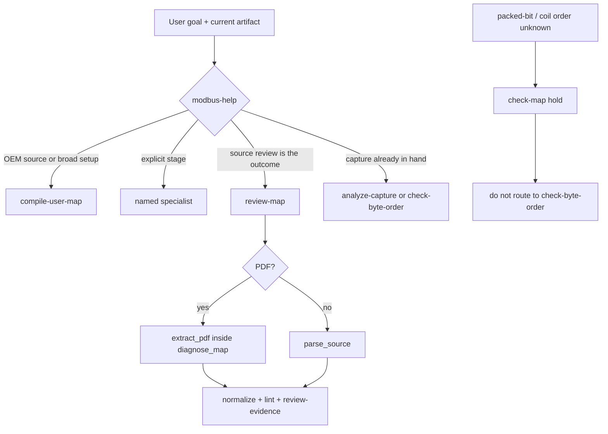

# fix: Align skill routing, workflow overlap, and coverage claims

## Goal Capsule

- **Objective:** Make agents take the same path a person should: `$compile-user-map` for OEM-to-outputs, one source-review workflow, honest bit-order coverage, and catalogs/tests that match the skills.
- **Authority:** `AGENTS.md` controls safety, human-time, and verification. `plugins/modbus-skills/references/interaction-contract.md` and `user-paths.md` control routing. `catalog/workflows.json` is the machine-readable chain source. Skill `SKILL.md` files are the operator instructions.
- **Execution profile:** Fix routing and catalog truth first. Add only the smallest runtime hold for packed-bit confusion. Do not add a new public skill.
- **Stop conditions:** Do not add write/broadcast/scan behavior, a Home Assistant or Ignition builder, a dedicated bit-order decoder skill, live device traffic, or vendor-map fixtures.
- **Tail ownership:** One PR. Merge only after `python3 scripts/verify_repo.py` and GitHub checks pass.

---

## Product Contract

### Summary

The fake usability adapter already routes a novice with a vendor spreadsheet to `$compile-user-map`. Real skill text still teaches a seven-stage specialist chain that ends in Node-RED. Three catalog workflows review the same map. Research claims `$check-byte-order` solves coil/packed-bit order, and it does not.

This work makes the published skills, workflows, and tests tell one story.

### Problem Frame

A commissioning engineer who says “I have a vendor spreadsheet and want a safe setup” should get `$compile-user-map`. Today `modbus-help` and `user-paths.md` tell the agent to run `normalize-map -> check-map -> plan-reads -> build-node-red -> capture-sample -> analyze-capture -> check-byte-order`. That path is the old specialist pipeline. It hard-codes Node-RED, skips the outcome compiler, and is locked in by `tests/test_workflow_catalog.py`.

Source review is split three ways: `extract-pdf-register-map`, `review-source-map`, and `review-register-map`. `compare-map-revisions` nests the structured-only chain, so two OEM PDFs can miss extraction. `diagnose_map` only calls `parse_source`; PDF intake is a skill-text handoff.

Bit-order confusion is a researched problem mapped to `$check-byte-order`. That skill evaluates ABCD/BADC/CDAB/DCBA. The runtime has no bit-order field or check.

### Actors

- A1. **Novice or commissioning user:** names a goal and a source; should not learn the catalog.
- A2. **Router (`modbus-help`):** recommends one next skill from goal + current artifact.
- A3. **Specialist skills:** run only when the user asked for that stage or the router named it.
- A4. **Catalog and tests:** prove the published path matches runtime behavior.

### Requirements

- R1. Broad OEM-source-to-usable-output and “I don’t know which skill” requests recommend `$compile-user-map` as the immediate next skill. Explicit stage requests still go to that specialist.
- R2. Do not present the seven-skill specialist chain as the default safe path. Node-RED is one target, not the default finish.
- R3. Keep one source-review workflow. `$review-map` must accept PDF and structured sources without telling the agent to choreograph `$extract-pdf-map` first.
- R4. `$extract-pdf-map` remains the specialist for extraction evidence. Its workflow must not be a second full review.
- R5. `compare-map-revisions` must review each side through the canonical source-review workflow so PDF and structured revisions both work.
- R6. `$check-byte-order` must state that it does not evaluate coil or packed-bit order. Research and the problem catalog must not map `bit-order-confusion` to it.
- R7. Packed-bit or coil-order ambiguity stays a hold. Do not guess a bit numbering convention.
- R8. `$capture-sample` completion is “probe generated and live-read gate presented,” not “sample already captured.”
- R9. Specialist handoffs that start from an OEM source and an organized-output goal recommend `$compile-user-map`.
- R10. Activation intents must be distinct user phrasings, not prefix-padded duplicates of two stems.
- R11. The novice-routing usability oracle must require the recommended skill to be `$compile-user-map`.
- R12. CLI entry points must accept skill IDs as aliases. Do not rename internal handlers in this PR.
- R13. README, `user-paths.md`, workflow catalog, and generated site must use one workflow inventory.
- R14. Preserve read-only safety, grouped exceptions, hash-bound artifacts, and `$compile-user-map` as the only user-visible OEM outcome owner.

### Acceptance Examples

- AE1. Given “I have a vendor spreadsheet and just want a safe read-only setup,” when `$modbus-help` runs, then it recommends `$compile-user-map` and does not print the seven-skill Node-RED chain as the safe path.
- AE2. Given an explicit “only parse this CSV” request, when `$modbus-help` runs, then it recommends `$parse-map`.
- AE3. Given a PDF source and “review this map,” when `$review-map` runs, then it extracts then reviews in one invocation and does not tell the user to run `$extract-pdf-map` first.
- AE4. Given `compare-map-revisions` with two PDF sources, when the workflow catalog is read, then both sides use `review-source-map`, not `review-register-map`.
- AE5. Given a coil or packed-bit field with no bit numbering convention, when `$check-map` runs, then a hold is recorded and `$check-byte-order` is not recommended as the fix.
- AE6. Given `$capture-sample` after a valid probe request, when the wrapper succeeds, then completion is the probe pack plus one live-read gate, not a required `capture/v1`.
- AE7. Given ten positive activation stems for a skill, when `build_activation_cases.py` runs, then uniqueness is counted on the stems, not on “Please/Can you” prefixes.
- AE8. Given CLI `modbus-skills check-map`, when invoked, then it runs the current `lint-map` handler.

### Scope Boundaries

- Do not add a new public skill.
- Do not implement a packed-bit candidate table or coil-order decoder. That is a follow-up skill.
- Do not add Home Assistant, Ignition, or other target builders.
- Do not rename CLI handlers (`lint-map`, `diagnose-map`, and the rest) in this PR; add aliases only.
- Do not change compile-user-map internal stage ownership or expose specialist choreography from that skill.
- Do not treat the real-model Codex usability campaign (`not-run`) as in-scope. Fake-adapter assertions are in scope.
- Do not edit the Skill Studio mockup beyond a one-line note if workflow count changes; that surface is separate.

---

## Planning Contract

### Key Technical Decisions

- KTD1. **Outcome-first routing.** `$modbus-help` and `user-paths.md` recommend `$compile-user-map` for OEM sources and broad setup. Specialist chains appear only for an explicit stage, an already-normalized map, or a capture already in hand. (chosen over keeping the seven-skill “complete safe path”: the fake adapter and architecture already treat compile as the primary path; the docs are stale.)
- KTD2. **One review workflow.** Delete `review-register-map`. Keep `review-source-map` as the canonical review. Extend `diagnose_map` to call existing `extract_pdf` when the input is a PDF, then parse/normalize/lint/review as today. Shorten `extract-pdf-register-map` to extraction evidence (`extract-pdf-map` → `review-evidence` → optional source-confirm gate). Point `compare-map-revisions` at `review-source-map`. (chosen over three overlapping chains: `$review-map` already claims end-to-end review; PDF was only missing inside `diagnose_map`.)
- KTD3. **Honest bit-order coverage, not a new skill.** Unmap `bit-order-confusion` from `$check-byte-order`. Add a deterministic hold when a coil, discrete, or packed-bit field has an inapplicable multi-register byte order or a missing bit-numbering convention. (chosen over building a bit-order evaluator: AGENTS.md says keep unresolved conventions as holds; a decoder is a later skill.)
- KTD4. **Shared byte-order confirmation, two probe fronts.** Add nested workflow `confirm-byte-order` (`check-byte-order` → human-gate → `apply-review`). `determine-byte-order` keeps `capture-sample` as its probe. `probe-resolve-finalize-tool-pack` keeps the tool-pack probe, then nests `confirm-byte-order`. (chosen over deleting one workflow: probe construction differs; confirmation must not.)
- KTD5. **CLI aliases, not a rename.** Resolve skill IDs in `run_cli` to existing handlers. Wrappers may call the skill ID. Tests keep exercising canonical handler names. (chosen over renaming: `tests/test_cli.py` enumerates `COMMANDS` and would churn without user-visible benefit.)
- KTD6. **Activation uniqueness on stems.** Require at least ten distinct `positive_stems` per skill in `activation-intents.json`. Prefix expansion may remain for extra phrasing but must not satisfy the count. (chosen over deleting prefixes: prefixes are cheap; they must not be the only diversity.)

### Assumptions

- `catalog/workflows.json` is hand-authored source. `catalog/skills.json`, `catalog/activation-cases.json`, and `site/` are generated after source edits.
- `diagnose_map` can reuse `extract_pdf` without changing PDF extraction policy, page bounds, or OCR rules.
- A missing bit-numbering convention on coils/discretes/packed fields can be detected from existing datatype/area/width fields plus an optional explicit convention token. No new public artifact type is required.
- Scenario `03-grouped-ambiguity` only stores `review-register-map` as metadata; retargeting the workflow id does not change its explicit `$normalize-map` entry.

### High-Level Technical Design

---

## Implementation Units

### U1. Outcome-first router

- **Goal:** Make `$modbus-help` and `user-paths.md` recommend `$compile-user-map` for OEM and broad setup.
- **Requirements:** R1, R2, R14; covers AE1, AE2.
- **Dependencies:** None.
- **Files:** `plugins/modbus-skills/skills/modbus-help/SKILL.md`, `plugins/modbus-skills/references/user-paths.md`, `tests/test_workflow_catalog.py`, `README.md`.
- **Approach:** Replace the hardcoded seven-skill chain. Router process: (1) explicit stage → that skill; (2) OEM source or organized user map/outputs → `$compile-user-map`; (3) source-review outcome → `$review-map`; (4) validated map + named tool → that builder; (5) capture present → `$analyze-capture` or `$check-byte-order`. Keep “complete path” as a short reference of stages, not the default recommendation. Rewrite `test_router_defaults_to_complete_safe_chain_but_keeps_direct_stage_routes` to assert compile-first routing plus direct stage routes.
- **Patterns to follow:** Current `modbus-help` reply format; `interaction-contract.md` one-next-step rule; fake adapter `play_01_novice_routing`.
- **Test scenarios:**
  - Covers AE1. Router text contains `$compile-user-map` as the broad OEM next skill and does not contain the Node-RED seven-skill string as the default path.
  - Covers AE2. Router still says to route an explicitly requested stage directly.
  - `user-paths.md` “I need an organized user map” remains the primary route and is what broad help uses.
- **Verification:** `tests.test_workflow_catalog` and skill validation pass.

### U2. One source-review workflow

- **Goal:** `$review-map` owns PDF and structured review. Delete the duplicate catalog chain.
- **Requirements:** R3, R4, R5; covers AE3, AE4.
- **Dependencies:** None. Can run in parallel with U1.
- **Files:** `plugins/modbus-skills/runtime/modbus_skills/map_workflows.py`, `plugins/modbus-skills/runtime/modbus_skills/cli.py`, `plugins/modbus-skills/skills/review-map/SKILL.md`, `catalog/workflows.json`, `tests/test_map_workflows.py`, `tests/test_workflow_catalog.py`, `tests/skill_usability/scenarios/03-grouped-ambiguity.json`.
- **Approach:** If `diagnose_map` input is a PDF path or PDF bytes, call existing `extract_pdf`, feed candidates into `normalize_map`, then lint and review as today. Missing `pdfplumber` still stops with the current dependency message. Remove process step “start with extract-pdf-map.” Delete workflow `review-register-map`. Point `compare-map-revisions` nested steps at `review-source-map`. Shorten `extract-pdf-register-map` to extract → review-evidence → optional human source-confirm. Update scenario `03` workflow id to `review-source-map`.
- **Patterns to follow:** `extract_pdf` error handling in the extract-pdf wrapper; `diagnose_map` envelope already returned by `review-map/scripts/run.py`.
- **Test scenarios:**
  - Covers AE3. A synthetic PDF source through `diagnose_map` yields parsed/canonical/lint/review without a second CLI invocation.
  - A CSV source through `diagnose_map` remains byte-equivalent to today’s result.
  - Catalog tests reject any remaining `review-register-map` id.
  - Covers AE4. `compare-map-revisions` nested workflow ids are `review-source-map`.
  - `extract-pdf-register-map` steps do not include `normalize-map`, `check-map`, or `apply-review`.
- **Verification:** Map workflow tests, workflow catalog tests, and `verify_repo.py` catalog drift checks.

### U3. Honest bit-order coverage

- **Goal:** Stop claiming `$check-byte-order` solves coil/packed-bit order. Surface a hold instead.
- **Requirements:** R6, R7; covers AE5.
- **Dependencies:** None. Can run in parallel with U1 and U2.
- **Files:** `plugins/modbus-skills/runtime/modbus_skills/validation.py`, `plugins/modbus-skills/skills/check-byte-order/SKILL.md`, `plugins/modbus-skills/skills/check-map/SKILL.md`, `research/issues.json`, `docs/research/problem-catalog.md`, `tests/test_validation.py` or existing lint tests.
- **Approach:** Add findings: multi-register `byte_order` on coil/discrete is an error; packed-bit or bitfield width with no explicit bit-numbering convention is a hold (`point.bit-order-unresolved`). `$check-byte-order` process states it does not evaluate coil or packed-bit order and hands that case to `$check-map`. Remap `bit-order-confusion` skills to `parse-map`, `check-map`, `review-evidence`. Add the row to the markdown problem catalog. Do not add layouts or a candidate table.
- **Patterns to follow:** Existing `point.unit-id-broadcast-forbidden` hold/error shape; grouped findings in `$check-map`.
- **Test scenarios:**
  - Covers AE5. A synthetic packed-bit point without a convention produces `point.bit-order-unresolved` and does not enter a final read plan.
  - A coil with `byte_order: ABCD` is an error.
  - A holding-register float with unknown byte order still uses the existing byte-order hold, not the bit-order hold.
  - `$check-byte-order` SKILL.md does not list bit order as in-scope.
- **Verification:** Validation unit tests plus skill validation.

### U4. Skill contract hygiene

- **Goal:** Make each skill’s completion, handoff, and stop list match runtime.
- **Requirements:** R8, R9, R12, R13; covers AE6, AE8.
- **Dependencies:** U1 for handoff targets; U3 for byte-order handoff text.
- **Files:** All `plugins/modbus-skills/skills/*/SKILL.md` (Stop section), especially `capture-sample`, `parse-map`, `extract-pdf-map`, `apply-review`, `check-byte-order`; `plugins/modbus-skills/runtime/modbus_skills/cli.py`; skill wrappers that still pass internal command names; `CONTRIBUTING.md`; `scripts/validate_skills.py`; `README.md`; `catalog/workflows.json` remap and byte-order workflows.
- **Approach:**
  - `$capture-sample`: completion = generated probe + one live-read gate. Sample identity is required later for `$check-byte-order`, not for this skill to finish.
  - `$parse-map` / `$extract-pdf-map` handoffs: organized user-map goal → `$compile-user-map`; candidate-only goal → `$normalize-map` or `$review-evidence`.
  - Add `## Stop` (3–6 bullets) to every skill. Derive from current process text and workflow stop conditions. Update `validate_skills.py` and `CONTRIBUTING.md` to require `## Stop` instead of an undefined “Blocking conditions” heading.
  - Add CLI aliases: `review-map`→`diagnose-map`, `check-map`→`lint-map`, `check-byte-order`→`evaluate-byte-order`, `extract-pdf-map`→`extract-pdf`, `apply-review`→`apply-review-decisions`, `plan-reads`→`compile-read-plan`, `build-node-red`→`generate-node-red`, `build-modpoll`→`generate-modpoll`, `build-modscan`→`generate-modscan`, `build-custom-export`→`infer-custom-format`. Keep `COMMANDS` as canonical names; resolve aliases before dispatch. Optionally point wrappers at skill IDs.
  - `remap-address-notation`: lint the remap output map, not the pre-remap input. Skill still applies when collision-free.
  - Byte-order workflows: add nested `confirm-byte-order` as in KTD4. Sharpen the two parent goals so they are not copies.
  - README “Complete workflow list”: split skills vs workflows and match `catalog/workflows.json` count and ids.
- **Patterns to follow:** Existing `## Handoff` / `## Finish` split in `validate_skills.py`; `run_cli` command dispatch.
- **Test scenarios:**
  - Covers AE6. `$capture-sample` SKILL.md completion text does not require `capture/v1`.
  - Every skill has `## Stop`; validator fails if it is missing.
  - Covers AE8. `run_cli("check-map", ...)` equals `run_cli("lint-map", ...)`.
  - Catalog remap workflow lint step input is the remap output.
- **Verification:** `scripts/validate_skills.py`, `tests.test_cli`, `tests.test_workflow_catalog`.

### U5. Activation cases and novice oracle

- **Goal:** Count real phrasings, and fail routing that recommends the wrong next skill.
- **Requirements:** R10, R11; covers AE1, AE7.
- **Dependencies:** U1 (router copy must already name compile-user-map).
- **Files:** `catalog/activation-intents.json`, `scripts/build_activation_cases.py`, `tests/test_activation_cases.py`, `tests/skill_usability/scenarios/01-novice-routing.json`, `scripts/skill_usability/oracles.py`, `tests/test_skill_usability_scenarios.py` or oracle tests.
- **Approach:** Author at least ten distinct positive stems per skill (natural requests, not “Please” clones). Keep five close-negatives. Builder may still prefix, but tests assert `len(set(positive_stems)) >= 10`. Add oracle condition `recommended_skill_matches` (or `expected_recommended_skill`) so scenario `01` requires `compile-user-map`. Keep `expected_route` as `modbus-help` for the selected skill.
- **Patterns to follow:** Existing `recommended_skill_present` check; fake adapter already emits `recommended_skill="compile-user-map"`.
- **Test scenarios:**
  - Covers AE7. Two stems plus five prefixes no longer pass.
  - Covers AE1. Fake-adapter trial `01` still passes. A recommendation of `normalize-map` fails the new condition.
- **Verification:** Activation tests and skill-usability contract/oracle tests.

### U6. Regenerate catalogs and site

- **Goal:** Published machine catalogs match the edited sources.
- **Requirements:** R13.
- **Dependencies:** U1–U5.
- **Files:** generated `catalog/skills.json`, `catalog/activation-cases.json`, `site/**`.
- **Approach:** Run `python3 scripts/build_catalog.py`, `python3 scripts/build_activation_cases.py`, and `python3 scripts/build_site.py`. Do not hand-edit generated files. Re-run each command and confirm a clean second pass.
- **Verification:** `python3 scripts/verify_repo.py`.

---

## Verification Contract

| Gate | Applies to | Done signal |
|---|---|---|
| Workflow catalog tests | U1, U2, U4 | Compile-first routing; no `review-register-map`; nested compare and byte-order workflows match KTD2/KTD4. |
| `diagnose_map` PDF + CSV tests | U2 | PDF review is one invocation; CSV results unchanged. |
| Validation tests | U3 | Packed-bit hold and coil+byte_order error; float byte-order hold unchanged. |
| Skill validator | U4 | Every skill has `## Stop`; capture-sample completion is probe-gate. |
| CLI alias tests | U4 | Skill IDs dispatch to existing handlers; canonical `COMMANDS` set still exercised. |
| Activation + oracle tests | U5 | Ten unique stems; novice trial requires `compile-user-map`. |
| `python3 scripts/verify_repo.py` | U1–U6 | Full repository gate passes, including catalog/site drift. |
| GitHub PR checks | U1–U6 | Required checks green before merge. |

---

## Definition of Done

- `$modbus-help` recommends `$compile-user-map` for OEM/broad setup and still routes explicit stages directly.
- `review-register-map` is gone. `$review-map` reviews PDF and structured sources in one run. `compare-map-revisions` uses `review-source-map`.
- `bit-order-confusion` is not mapped to `$check-byte-order`. Packed-bit ambiguity is a hold.
- `$capture-sample` does not claim a captured sample as its completion criterion.
- CLI skill-id aliases work. Internal handler names remain.
- Activation counts unique stems. Novice usability oracle requires `compile-user-map`.
- README and generated site match `catalog/workflows.json`.
- No new public skill, live traffic, vendor fixture, or handler rename lands in the diff.
- `python3 scripts/verify_repo.py` and GitHub checks pass.

---

## Follow-up (out of this PR)

- Dedicated packed-bit / coil-order evidence skill with a candidate table, analogous to `$check-byte-order`.
- Real-model Codex usability campaign once the app-server schema is available.
- Native Modpoll / ModScan / Witte verification (already on the publication checklist).
- Optional later CLI handler rename once aliases have been stable.
