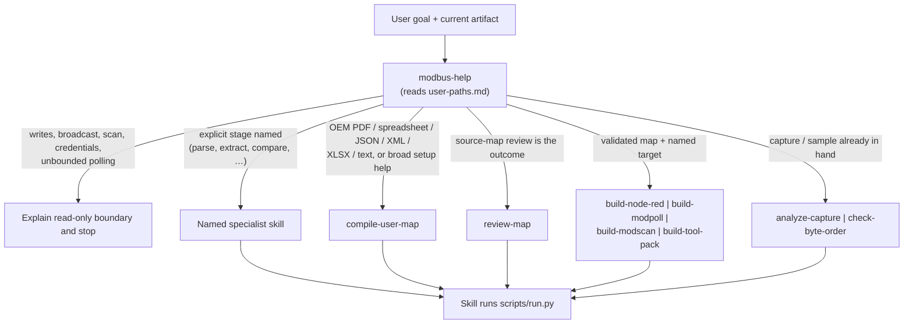
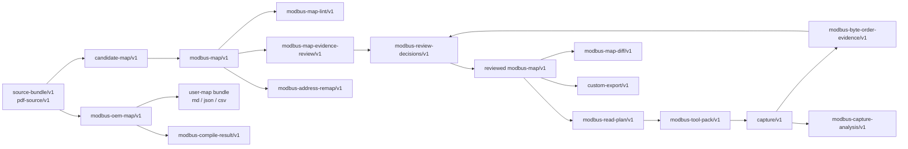
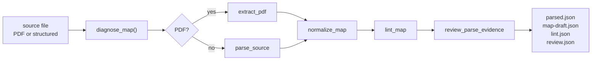
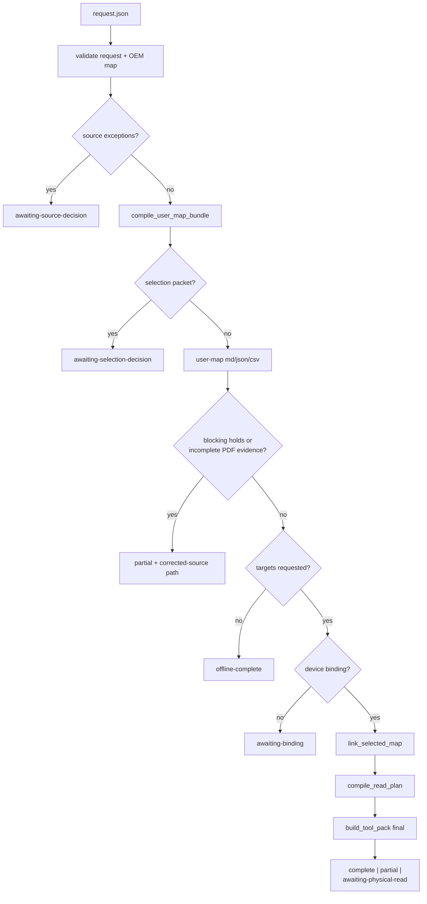
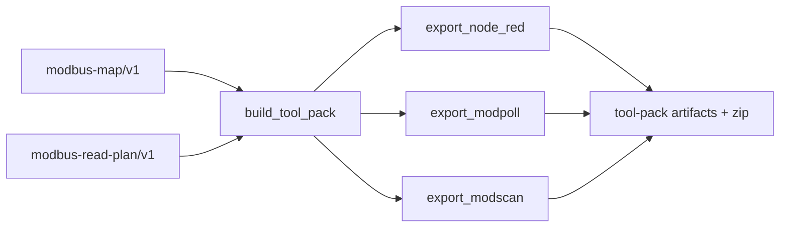

# Skill execution map

Machine-readable workflow chains live in [`catalog/workflows.json`](../../catalog/workflows.json).
High-level routing lives in [`user-paths.md`](../../plugins/modbus-skills/references/user-paths.md).
This document maps **which skill runs when**, **what it depends on**, and **which script and runtime code execute**.

Legend:

- **Skill** — agent-invoked `SKILL.md` workflow
- **Gate** — human or external step (no `run.py`)
- **Runtime** — deterministic Python in `plugins/modbus-skills/runtime/modbus_skills/`

## Router decision tree

`modbus-help` recommends work only; it runs no script.



**Routing rule:** prefer the skill that completes the stated outcome. Do not replace `compile-user-map` with a parse → normalize → plan → builder chain for OEM-to-output requests.

## Workflow catalog chains

Each workflow in `catalog/workflows.json` is a ordered chain of skills, nested workflows, and gates.


Gate kinds:

| Kind | Who acts | Typical output |
| --- | --- | --- |
| `human-gate` | Engineer confirms grouped choices | `modbus-review-decisions/v1` or `review-disposition/v1` |
| `external-gate` | Operator runs probe in Node-RED, Modpoll, or ModScan | `capture/v1` (`capture.json`) |

## Artifact dependency graph

Skills consume and produce typed artifacts. Arrows show the usual forward flow; specialist skills can start mid-chain when the artifact already exists.



## Script execution reference

Every operational skill (except `modbus-help`) ends in:

```text
python3 plugins/modbus-skills/skills/<skill>/scripts/run.py …
  → modbus_skills.cli.run_cli("<handler>", argv)
  → runtime handler in cli.py
  → domain module(s)
```

| Skill | `run.py` invokes | CLI handler | Primary runtime module(s) |
| --- | --- | --- | --- |
| `compile-user-map` | `compile-user-map` | `_handle_compile` | `compiler.compile_user_map` → `user_map`, `read_plan`, `tool_pack` |
| `parse-map` | `parse-map` | `_handle_parse` | `parsers.parse_source` |
| `extract-pdf-map` | `extract-pdf` | `_handle_pdf` | `pdf_extraction.extract_pdf` |
| `normalize-map` | `normalize-map` | `_handle_normalize` | `map_workflows.normalize_map` |
| `check-map` | `lint-map` | `_handle_lint` | `map_workflows.lint_map` |
| `review-map` | `diagnose-map` | `_handle_diagnose` | `map_workflows.diagnose_map` (see composite below) |
| `review-evidence` | `review-evidence` | `_handle_review` | `map_workflows.review_parse_evidence` (+ optional `lint_map`) |
| `apply-review` | `apply-review-decisions` | `_handle_decisions` | `decisions.apply_review_decisions` |
| `remap-addresses` | `remap-addresses` | `_handle_remap` | `address.resolve_address` (preview / apply in CLI) |
| `compare-maps` | `compare-maps` | `_handle_compare` | `comparison.compare_maps` |
| `capture-sample` | `capture-sample` | `_handle_capture` | `read_plan.compile_read_plan`, `tool_pack.build_tool_pack` (probe) |
| `check-byte-order` | `evaluate-byte-order` | `_handle_byte_order` | `byte_order.evaluate_byte_orders` |
| `plan-reads` | `compile-read-plan` | `_handle_plan` | `read_plan.compile_read_plan` |
| `build-node-red` | `generate-node-red` | `_handle_node_red` | `node_red.export_node_red` |
| `build-modpoll` | `generate-modpoll` | `_handle_modpoll` | `modpoll.export_modpoll` |
| `build-modscan` | `generate-modscan` | `_handle_modscan` | `modscan.export_modscan` |
| `build-tool-pack` | `build-tool-pack` | `_handle_tool_pack` | `tool_pack.build_tool_pack` → target exporters |
| `analyze-capture` | `analyze-capture` | `_handle_analysis` | `analysis.analyze_capture` |
| `build-custom-export` | `infer-custom-format` | `_handle_custom` | `custom_format.validate_custom_format`, `render_custom_format` |
| `modbus-help` | — | — | reads `user-paths.md`; no runtime call |

CLI skill IDs are aliases resolved in `cli.COMMAND_ALIASES` (for example `check-map` → `lint-map`, `review-map` → `diagnose-map`).

### `run.py` command lines (from `SKILL.md`)

| Skill | Typical invocation |
| --- | --- |
| `compile-user-map` | `run.py --request request.json --output <case-dir>` |
| `parse-map` | `run.py --input <path> --output <path>` |
| `extract-pdf-map` | `run.py --input manual.pdf --output <dir> [--pages <range>]` |
| `normalize-map` | `run.py --input candidate.json --output normalized.json` |
| `check-map` | `run.py --input map.json --output validation.json` |
| `review-map` | `run.py --input <path> --output <directory>` |
| `review-evidence` | `run.py --input artifact.json --output report.json` |
| `apply-review` | `run.py --map draft.json --decisions decisions.json [--evidence evidence.json] --output reviewed.json` |
| `remap-addresses` | `run.py --input map.json --from <conv> --to <conv> --output preview.json` |
| `compare-maps` | `run.py --before old.json --after new.json --output diff.json` |
| `capture-sample` | `run.py --request probe.json --output <directory>` |
| `check-byte-order` | `run.py --input capture.json --types uint32,int32,float32 --output evidence.json` |
| `plan-reads` | `run.py --input map.json --output read-plan.json --max-gap <n>` |
| `build-node-red` | `run.py --map map.json --plan read-plan.json --mode <probe\|final> --output <dir>` |
| `build-modpoll` | `run.py --map map.json --plan read-plan.json --profile <profile> --mode <mode> --output <dir>` |
| `build-modscan` | `run.py --map map.json --plan read-plan.json --mode <mode> --output <dir>` |
| `build-tool-pack` | `run.py --request tool-pack-request.json --output <directory>` |
| `analyze-capture` | `run.py --input <capture> --options options.json --output analysis.json` |
| `build-custom-export` | `run.py --example <path> --map map.json --output <directory>` |

## Composite skill internals

Some skills chain multiple runtime steps inside **one** `run.py` invocation.

### `review-map` → `diagnose-map`



Equivalent specialist chain (only when each stage is the explicit outcome): `extract-pdf-map` or `parse-map` → `normalize-map` → `check-map` → `review-evidence`.

### `compile-user-map`

One case directory; the compiler may pause for human decisions and resume with `--case` + `--resume`.



Internal stages are **not** exposed as separate skill invocations during a normal compile.

### `capture-sample` and `build-tool-pack`

Both call `build_tool_pack`, which fans out to target exporters:



`capture-sample` builds **probe** mode only and stops before the live read. `build-tool-pack` uses the requested mode (`probe` or `final`).

### `check-byte-order` → `apply-review` (byte-order path)

Evidence does not pick a layout. A human records one layout in `modbus-review-decisions/v1`; `apply-review` writes the confirmed map. Downstream: `plan-reads` → builder or `build-tool-pack`.

## User-path quick reference

Condensed from `user-paths.md`:

| Situation | Path |
| --- | --- |
| OEM source → organized outputs | `compile-user-map` |
| Source-map review outcome | `review-map` → (`apply-review` after human gate) |
| Validated map → tool files | `plan-reads` → one builder or `build-tool-pack` |
| Unknown byte order, no sample | `capture-sample` → external read → `check-byte-order` → `apply-review` → `plan-reads` → builder |
| Bad values / comms | `analyze-capture` |
| Firmware / map revision | `review-map` (each side) → `compare-maps` |
| Custom text/CSV format | `check-map` → `build-custom-export` |
| Address notation change | `remap-addresses` → `check-map` |

## Excalidraw note

This file uses Mermaid for version-controlled, diff-friendly diagrams. For whiteboard-style layout in Excalidraw:

1. Import the workflow subgraphs above as separate frames (router, catalog, artifacts, composites).
2. Use the script table for node labels on each skill box (`run.py` → handler → module).
3. Gate nodes should be dashed shapes distinct from skill rectangles.
