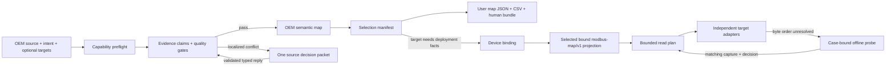

# Fast OEM Map Compiler - Plan

## Goal Capsule

- **Objective:** Turn an OEM Modbus manual into an organized user map and requested read-only output within minutes.
- **Primary actor:** A controls or commissioning engineer who can judge real Modbus ambiguity but should not operate the extraction pipeline.
- **Product authority:** Human attention is reserved for engineering decisions that automation and source evidence cannot settle.
- **Execution profile:** Implement U1-U7 in dependency order. Keep the existing specialist commands and `modbus-map/v1` consumers compatible while the new outcome workflow is added.
- **Stop conditions:** Stop on a scope-changing contradiction, a public-boundary violation, a new runtime dependency, or a safety change that would permit live communication or Modbus writes. Do not stop for implementation details already bounded by this plan.
- **Tail ownership:** The executor updates generated catalog and site artifacts, runs the full repository verifier, and removes abandoned experimental code before handoff. Opening a PR is outside this plan unless the user requests it.

---

## Product Contract

### Summary

Add one explicit `$compile-user-map` skill that accepts an OEM source, plain-language point intent, and optional output targets. It completes all safe local work, returns a compact user map and requested outputs, and reports any bounded source, capability, resource, deployment, or physical-device exception with one permitted next action.

### Problem Frame

The current corpus exposes nineteen focused skills and a router that recommends the next stage and stops. In the observed OEM-manual run, the user had to supply pages the agent could discover, recover from a failed parser, approve evidence page by page, interpret repeated holds, select points outside a supported contract, correct fragmented reads, and invoke successive stages. The result took longer than manually reading the map even though most work was local and deterministic.

Matt Pocock's `writing-for-agents` method identifies the same skill-design failures: cognitive load from too many user decisions, branch-specific mechanics disclosed too early, future-goal rushing, weak completion criteria, duplicated routing, and instructions that do not change executable behavior.

### Key Product Decisions

- **Compile the outcome, not the stages.** Use `compile` as the leading word and make the primary skill complete the user's map-and-output job. Governs R1-R4.
- **Keep specialist skills.** Preserve focused parsing, review, planning, target, probe, and diagnostic skills as explicit expert entry points. Do not make all skills compete for model invocation. Governs R2 and R16.
- **Separate three truths.** Keep OEM semantics, user selection, and device binding independently reusable. Governs R8-R10.
- **Review exceptions by phase.** A source phase may produce one grouped decision packet. Physical read and byte-order confirmation remain later independent gates. Governs R6, R7, and R14.
- **Optimize for human minutes.** This user-set decision replaces page-by-page approval because serial review took longer than manual source reading. Governs R5, R6, and R17-R20.

### Actors

- A1. **Engineer:** Supplies the source and desired measurements, answers real engineering ambiguities, and performs any explicitly requested physical read.
- A2. **Compiler skill:** Owns discovery, extraction, validation, selection, planning, output generation, checkpointing, and concise reporting.
- A3. **Deterministic runtime:** Performs parsing, transforms, validation, packing, rendering, state transitions, and provenance checks.

### Requirements

**Primary experience**

- R1. One invocation accepts a PDF or structured OEM map, plain-language measurement intent, and zero or more requested output targets.
- R2. The primary skill runs the complete safe local workflow instead of telling the user which stage skill to invoke next.
- R3. With no target named, the default deliverable is an organized user map plus machine-readable JSON and CSV.
- R4. With a target named, the same run also produces that target or reports the exact blocking exception.
- R5. A clean local source completes with no human approval question.
- R6. Source ambiguities are presented once per evidence phase as a compact root-cause-grouped decision packet with recommended dispositions and affected counts.
- R7. The skill converts a bounded plain-language reply into a typed candidate decision. The runtime applies it and resumes only after validating the case, hashes, decision IDs, evidence, and scope.

**Map model and selection**

- R8. The OEM semantic map contains source-backed register meaning and lineage but does not require route, endpoint, or unit binding.
- R9. A selection manifest records requested measurements, included points, suggested points, exclusions, groups, aliases, confidence, and the reason for each disposition.
- R10. A separate device-binding artifact supplies route, unit, transport, and read-constraint facts only when the requested output needs them.
- R11. Readiness is evaluated for the selected output slice, so unresolved unselected registers remain visible without blocking correct selected points.
- R12. Every delivered point links to its source page and row. A disputed field also links to the bounded source region that caused the exception.

**Extraction and planning**

- R13. PDF intake locates likely register pages and tries a bounded extraction ladder before asking the user for pages, OCR, or parser choices.
- R14. Extraction passes only when coverage, row shape, datatype width, address consistency, provenance, and available parser-agreement checks pass. Only failed regions enter review.
- R15. Read planning minimizes safe bounded requests across each route, unit, function code, and readable address island. It never bisects a multi-register point or crosses a documented unsafe range.
- R16. Target adapters remain independently testable and preserve their native verification boundaries.

**Skill-writing discipline**

- R17. Every `SKILL.md` declares one observable completion criterion that matches the human outcome of that skill.
- R18. Branch-only instructions live behind explicit context pointers. Deterministic or repeatedly rewritten procedures live in tested runtime code.
- R19. Routing has one source of truth. Local handoffs remain only when they depend on the current result.
- R20. Every skill section passes the deletion test: if removing it does not change behavior in forward tests, remove it.

### Skill Corpus Map

| Surface | Planned role |
|---|---|
| New `$compile-user-map` | Primary outcome skill; source and intent in, user map and selected outputs out. |
| `$modbus-help` | Small fallback router that directs outcome requests to `$compile-user-map`; no default stage choreography. |
| Map intake and review skills | Focused expert entry points and deterministic internal boundaries; no misleading end-to-end claims or page mechanics in the primary path. |
| `$plan-reads` | Compile selected points into evidence-bounded contiguous reads; remove `max-gap 0` as the outcome workflow's default objective. |
| Target builders | Adapters called by the compiler; retain target-specific verification and partial-result states. |
| Capture and byte-order skills | Separate hardware/evidence path; never hidden inside the default offline run. |
| Compare and remap skills | Independent expert tools outside the primary OEM-to-output path. |

### Key Flows

- F1. **Clean offline compile**
  - **Trigger:** A1 supplies an OEM source and measurement intent.
  - **Steps:** A2 preflights capabilities, discovers and extracts the map, validates evidence, builds the OEM map, selects points, and emits the bundle.
  - **Outcome:** The run finishes without a question and reports counts, elapsed time, outputs, and non-blocking exclusions.
  - **Covers:** R1-R5, R8-R14.
- F2. **Source exception and resume**
  - **Trigger:** One or more extraction or semantic checks fail.
  - **Steps:** A2 finishes unaffected work, groups exceptions by shared cause, asks one phase-scoped question, compiles the reply into a typed candidate, and resumes after runtime validation.
  - **Outcome:** The selected slice finishes or the unresolved exception remains quarantined with a precise reason.
  - **Covers:** R6, R7, R11, R12, R14.
- F3. **Target generation after binding**
  - **Trigger:** A requested target requires route, unit, or read constraints that are absent.
  - **Steps:** A2 preserves the complete offline user map, emits one binding packet, validates the supplied binding, links only the selected slice, plans reads, and invokes target adapters.
  - **Outcome:** Successful targets remain usable. Held targets report one exact next action.
  - **Covers:** R4, R10, R11, R15, R16.
- F4. **Physical byte-order resolution**
  - **Trigger:** A final decoder needs byte order that the source cannot establish.
  - **Steps:** A2 emits a case-bound offline probe. A1 performs one bounded read. The byte-order skill compares layouts before A1 confirms one.
  - **Outcome:** The compiler invalidates the stale plan and rebuilds final outputs. This exchange is separate from source review.
  - **Covers:** R4, R7, R16.

### Acceptance Examples

- AE1. **Merged-cell PDF succeeds without page approval.** Given a 150-row manual whose strict parser fails but coordinate extraction passes the quality gates, when the engineer requests temperatures and status points, then the compiler emits the user map and no page-by-page question. Covers R5, R13, R14.
- AE2. **One localized ambiguity stays localized.** Given one blank or conflicting field, when all other rows pass, then one exception group names the source region and unaffected selected points still compile. Covers R6, R11, R12.
- AE3. **Sparse points use one safe span.** Given selected FC03 points from offsets 257 through 308 within one evidenced readable island, when reads are planned, then the planner emits one bounded span and records bridged unselected registers. Covers R15.
- AE4. **Offline work does not wait for deployment facts.** Given no endpoint or unit identifier, when only an organized user map is requested, then the map completes and device binding remains absent. Covers R3, R8-R10.
- AE5. **Plain-language confirmation resumes safely.** Given a grouped source packet, when the engineer replies with a bounded instruction and exceptions, then the skill constructs a typed candidate and the same case resumes after deterministic validation. Covers R6, R7.
- AE6. **A target hold does not erase completed work.** Given JSON, CSV, and two target outputs where one target lacks binding, when generation runs, then the offline bundle and successful target remain committed and only the held target is retried. Covers R4, R10, R16.
- AE7. **A stale or broadened reply fails safely.** Given a packet whose input hash changed or a reply that adds an unoffered disposition, when it is applied, then the runtime rejects it without changing case state or duplicating audit history. Covers R7, R12.

### Success Criteria

- A representative, rights-safe, approximately 150-row OEM PDF produces its offline bundle in at most five minutes on the documented local benchmark envelope.
- A clean run requires one skill invocation and zero questions.
- A run with source ambiguity requires at most one grouped source-decision exchange before offline outputs complete.
- Human attention for the offline path is under two minutes, excluding an explicitly requested physical read.
- Every selected point is present exactly once in the human map, JSON, and CSV and is traceable to source evidence.
- Transcript acceptance tests fail on repeated questions, page-by-page review, mid-run dependency installation, stage handoffs, or avoidable read fragmentation.

### Scope Boundaries

- Live writes, broadcast requests, discovery scans, live connection management, and unbounded polling remain outside the product.
- The compiler may generate a bounded read probe but never executes it.
- Source evidence never guesses byte order or other consequential semantics merely to finish.
- Version 1 uses preinstalled PDF text/layout capabilities and accepts rights-safe OCR evidence. It does not add or install an OCR dependency.
- Version 1 does not add a general workflow engine, distributed cache, or DAG scheduler.
- Native application import remains a visible verification state, not an automated claim when the application is unavailable.

### Dependencies and Assumptions

- Python 3.11 and the standard library remain the runtime dependency baseline.
- A compatible `pdftotext` capability is required for direct PDF extraction. Preflight occurs before case creation and fails once with one remedy when the capability is absent.
- Quality thresholds are calibrated on representative synthetic or redistribution-safe fixtures, not model self-confidence.
- Existing deterministic artifact envelopes, grouped-review decisions, stale-hash rejection, planners, and target adapters remain the compatibility foundation.

### Sources and Research

- Matt Pocock, [Writing for Agents](https://www.aihero.dev/skills-writing-for-agents), [`writing-for-agents`](https://github.com/mattpocock/skills/blob/main/skills/productivity/writing-for-agents/SKILL.md), [Skill Mechanics](https://github.com/mattpocock/skills/blob/main/skills/productivity/writing-for-agents/SKILL-MECHANICS.md), and [Building Great Agent Skills: The Missing Manual](https://www.youtube.com/watch?v=UNzCG3lw6O0). These sources establish progressive disclosure, tested mechanics, cognitive-load reduction, completion criteria, and the deletion test.
- `AGENTS.md` establishes the public boundary, read-only Modbus posture, standard-library policy, and human-time budget.
- `plugins/modbus-skills/runtime/modbus_skills/artifacts.py`, `map_workflows.py`, and `decisions.py` provide deterministic envelopes, grouped exceptions, and stale-hash decision validation.
- `plugins/modbus-skills/runtime/modbus_skills/models.py`, `read_plan.py`, and `exporters.py` expose the current binding-coupled compatibility boundary.
- `plugins/modbus-skills/runtime/modbus_skills/cli.py` contains the PDF extraction code and flat command surface that the outcome compiler must orchestrate.
- `scripts/run_human_workflow_tests.py` and `scripts/verify_repo.py` define the current workflow and repository verification seams.
- No `docs/solutions/` or `CONCEPTS.md` corpus exists, so there are no prior repository learnings to apply.

---

## Planning Contract

### Product Contract Preservation

The requirements, flows, and acceptance examples remain materially unchanged from the `ce-brainstorm` artifact. Planning resolves the public name as `$compile-user-map`, keeps bundled OCR outside version 1, defines the benchmark as a local rights-safe corpus run, and tightens R7 so plain-language interaction cannot bypass typed runtime validation.

### Key Technical Decisions

- **KTD1 — Add a backward-compatible three-layer artifact model.** Add `modbus-oem-map/v1`, `modbus-user-selection/v1`, `modbus-device-binding/v1`, `modbus-user-map/v1`, and `modbus-compile-case/v1`. Keep `modbus-map/v1` as the selected, bound compatibility projection for existing planners and exporters. This avoids coupling offline work to route and unit fields without rewriting every adapter. Governs R3, R8-R12, U1, U3, U4.
- **KTD2 — Use one outcome command and one public skill.** Add one `compile-user-map` runtime command with request, case, and resume inputs instead of exposing separate start, inspect, and resume commands. The result manifest always reports current state, artifacts, holds, and next permitted action. Specialist commands remain available. This minimizes routing and command choreography. Governs R1-R4, R17-R20, U5, U6.
- **KTD3 — Separate conversational interpretation from authority.** The skill may translate plain language into typed selection and decision candidates. Only deterministic code may validate and commit them. It rejects unknown decisions, broadened scope, missing evidence, stale hashes, and modified replay. Exact replay returns the prior committed transition. Governs R6, R7, R12, U3, U5.
- **KTD4 — Preserve competing extraction claims before normalization.** Each extraction strategy emits evidence claims with parser identity, physical page, bounded region, excerpt, candidate value, and confidence. Formatting-only differences may resolve automatically. Conflicts affecting row identity, address, area, width, datatype, access, or selected meaning become localized exceptions. Governs R5, R6, R12-R14, U2.
- **KTD5 — Implement a small persisted state machine, not a workflow platform.** The case manifest records immutable input hashes, completed receipts, artifacts, active packet, requested targets, and next action. Atomic replacement and descendant invalidation provide restart safety. The allowed states are `running`, `awaiting-source-decision`, `offline-complete`, `awaiting-binding`, `awaiting-physical-read`, `awaiting-byte-order-decision`, `partial`, `complete`, and `failed`. Governs R2, R4-R7, U5.
- **KTD6 — Compile only the selected slice into legacy consumers.** The user map shows included, suggested, excluded, and quarantined points. Only included points and their relevant holds enter the `modbus-map/v1` projection. Existing exporter preflight remains strict. Unselected holds stay in the OEM artifact and exception annex. Governs R9-R11, R16, U3, U4.
- **KTD7 — Pack reads only across evidenced readable islands.** Replace the compiler path's implicit `max_gap=0` objective with bounded span packing informed by area, route, unit, source island, explicit unsafe intervals, device quantity caps, and protocol caps. Record every bridged interval. Unknown or hazardous gaps split requests. Governs R15, U4.
- **KTD8 — Keep device reads outside the compiler.** A physical gate produces a case-bound probe pack. Resume accepts only a matching immutable capture and never accepts endpoint credentials or opens TCP or serial connections. Byte order remains a separate evidence-backed confirmation. Governs R4, R16, U5.
- **KTD9 — Measure human time through transcripts and wall time separately.** Deterministic acceptance tests enforce invocation, question, handoff, replay, and artifact-count budgets. A local representative benchmark enforces the five-minute target without making CI timing-flaky. Governs R5-R7, R13-R20, U7.

### High-Level Technical Design

The compiler case is the shared human and agent interface. Each invocation consumes the same request or existing case manifest and returns the same `compile-result.json`. No required state exists only in chat, a visual UI, or process memory.

### Case and Invalidation Rules

- Preflight failure creates no partial case.
- A case ID derives from source, request, and compiler-version hashes. Repeating the same start is idempotent. Changed inputs create a new case or require an explicit new-case action.
- Source or extraction changes invalidate OEM map, selection, binding projection, plans, and targets.
- Selection changes preserve source and OEM artifacts but invalidate the projection, plans, and targets.
- Binding changes preserve source, OEM, selection, and offline bundle but invalidate plans and bound targets.
- A matching decision or capture commits one atomic transition. Exact replay returns that transition. Modified replay is rejected.
- `partial` preserves successful targets and retries only held or invalidated targets.

### Implementation Constraints

- Use `apply_patch` for repository edits and preserve the existing dirty worktree.
- Keep all fixtures synthetic or redistribution-safe. Do not add OEM manuals, customer data, endpoint details, or credentials.
- Keep the runtime on Python 3.11 standard library. Do not add OCR, PDF, workflow, or database packages.
- Preserve read-only function codes 01-04 and existing target verification boundaries.
- Generate catalog, activation, and site artifacts with repository scripts. Do not hand-edit generated outputs.
- Keep public `SKILL.md` files concise. Put deterministic behavior in runtime code and branch-specific detail in referenced files.

### System-Wide Impact

- **Compatibility and lineage:** The new artifacts are additive and compiler-owned. Existing specialist commands continue to accept `modbus-map/v1`. Existing planners and targets receive only the selected, bound compatibility projection. `compile-result.json` carries the OEM, selection, binding, projection, plan, and target hashes so lineage does not stop at the immediate map/plan pair. Owned by KTD1 and KTD6; implemented in U1, U4, and U5.
- **Case lifecycle:** Artifacts stage inside the case root before the case manifest commits last. Each input mutation preserves valid ancestors and invalidates only named descendants. A case created by another compiler contract version returns one explicit state: resumable, upgrade required, or incompatible. It never silently forks. Owned by KTD5; implemented in U1 and U5.
- **Decision boundaries:** Source-claim decisions use the case- and phase-bound packet because no canonical map exists yet. The current `modbus-review-decisions/v1` remains the authority for supported projected-map and byte-order mutations. Owned by KTD3 and KTD4; implemented in U3 and U5.
- **Human and agent parity:** Every nonterminal result includes a closed `next_action`, the human-readable packet, the exact typed candidate shape accepted on resume, scope and evidence references, and verification state. A direct CLI user, the public skill, or another agent can inspect and resume the same case. Native import remains `not-run` until verified outside the compiler. Owned by KTD2, KTD3, and KTD8; implemented in U5 and U6.
- **Routing and generated surfaces:** `plugins/modbus-skills/references/user-paths.md` owns high-level routing. `catalog/workflows.json` owns detailed workflow gates. Skill frontmatter owns skill metadata. Catalog, activation, and site files are generated projections. U6 changes those sources and U7 rebuilds the projections.
- **Artifact portability:** User maps and target bundles are portable deliverables. Case state, source claims, decision history, and captures are local control data. Portable artifacts use allowlisted fields and logical source references; they do not embed absolute paths, credentials, endpoints, captures, or manual excerpts. Owned by KTD1 and KTD5; implemented in U1, U3, U5, and U7.

### Risks and Dependencies

- **Pathological PDF input may exhaust time or resources.** Run PDF tools with argument arrays, per-case temporary storage, bounded time, page count, output bytes, and stderr. Record tool/version receipts and emit one deterministic resource-limit hold. U2 tests shell metacharacters, malformed input, oversized output, and timeout behavior. This preserves KTD4 and the five-minute target.
- **Case paths may permit traversal, symlink escape, or artifact substitution.** Use allowlisted case-relative artifact names, resolve containment before access, hash every artifact and parent link, write privately, and commit the manifest by atomic replace. U1 and U5 reject absolute paths, `..`, symlink escape, swapped artifacts, and interrupted writes. This mitigates KTD5.
- **A decision or capture may be replayed against changed evidence.** Bind each gate to the case, phase, relevant source/OEM/selection/binding hashes, packet or probe identity, and consumed decision ID. Identical replay is idempotent; any changed field is stale. U3 and U5 cover cross-case, reordered, altered-capture, and superseded-packet cases. This mitigates KTD3 and KTD8.
- **Portable outputs may leak source text or deployment details.** Use an allowlisted portable projection with page, row, region ID, and hash references. Keep excerpts, captures, endpoint data, and review rationale in local case storage. U1, U3, and U7 test secret-like values and absolute paths across JSON, CSV, manifests, and target packs.
- **The extraction ladder may regress the speed target.** Bound strategy escalation and record per-phase duration plus input/output counts. Do not hide invalidation or performance behind a cache in version 1. U7 benchmarks a cold representative merged-cell case and attributes any timeout to a named phase. This mitigates KTD9 without adding a caching subsystem.

### Sequencing

U1 establishes contracts. U2 and U3 can then implement source evidence and user selection. U4 links the selected slice and changes read packing. U5 orchestrates those settled runtime seams. U6 exposes the outcome and simplifies the skill corpus. U7 verifies the whole human-time contract and refreshes generated artifacts.

---

## Implementation Units

### U1. Add compiler artifact contracts

- **Goal:** Create deterministic contracts for OEM semantics, user selection, device binding, user maps, and persisted compile cases without breaking `modbus-map/v1` consumers.
- **Requirements:** R3, R8-R12; supports F1-F4 and AE4.
- **Dependencies:** None.
- **Files:** `plugins/modbus-skills/runtime/modbus_skills/compiler_contracts.py`, `plugins/modbus-skills/runtime/modbus_skills/artifacts.py`, `plugins/modbus-skills/runtime/modbus_skills/models.py`, `docs/contracts/artifacts.md`, `tests/test_compiler_contracts.py`.
- **Approach:** Follow the envelope and canonical-hash patterns in `artifacts.py`. Define schema IDs, required fields, deterministic ordering, and cross-artifact hash links. OEM point identity excludes deployment binding. Keep current `CanonicalPoint` and composite bound identity intact for the compatibility projection.
- **Test scenarios:**
  - Positive: Equivalent OEM, selection, binding, user-map, and case data serialize byte-identically and keep stable hashes.
  - Negative: A selection or binding that references an unknown OEM point or wrong OEM hash is rejected.
  - Incomplete: An OEM map without route, unit, or endpoint is valid, while a binding omitting required route or unit fields is not valid for a bound target.
  - Safety/privacy: A portable user-map artifact excludes endpoint credentials and private evidence payloads while retaining source references.
- **Verification:** `python3 -m unittest tests.test_compiler_contracts` passes. Existing `tests.test_core_models` and `tests.test_exporters` remain green.

### U2. Extract PDF intake into an evidence-preserving strategy ladder

- **Goal:** Discover register regions, run bounded extraction strategies, reconcile claims, and quarantine only material conflicts before asking for help.
- **Requirements:** R5, R6, R12-R14; supports F1, F2, AE1, and AE2.
- **Dependencies:** U1.
- **Files:** `plugins/modbus-skills/runtime/modbus_skills/pdf_extraction.py`, `plugins/modbus-skills/runtime/modbus_skills/cli.py`, `plugins/modbus-skills/skills/extract-pdf-map/references/pdf-evidence.md`, `tests/test_pdf_extraction.py`, `tests/test_cli.py`, `tests/fixtures/compiler/`.
- **Approach:** Move `_handle_pdf` and related PDF parsing mechanics out of `cli.py`. Preflight `pdftotext` once. Discover candidate pages from text and layout signals. Run strict row parsing, then coordinate/layout parsing. Emit field-level claims and region quality findings. Auto-resolve only non-semantic formatting differences. Keep OCR as an accepted external evidence input, not a runtime dependency.
- **Test scenarios:**
  - Positive: Strict extraction of a clean synthetic map passes all gates with no review packet.
  - Fallback: A merged-cell fixture yields zero strict rows, coordinate extraction recovers the expected rows, and no page approval is requested.
  - Conflict: Two strategies disagree on one address or datatype; only that bounded region enters one grouped packet.
  - Incomplete: Missing `pdftotext` fails preflight once with one remedy and creates no half-populated case.
  - Safety/privacy: Extraction rejects an out-of-workspace or unsupported evidence reference and never invokes OCR installation.
- **Verification:** `python3 -m unittest tests.test_pdf_extraction tests.test_cli` passes with subprocess calls mocked. Fixtures contain no vendor material.

### U3. Compile validated selection and the offline user-map bundle

- **Goal:** Convert user intent into a hash-bound selection and emit a compact organized map without requiring deployment facts.
- **Requirements:** R1, R3, R7-R12; supports F1, F2, AE2, AE4, AE5, and AE7.
- **Dependencies:** U1 and U2.
- **Files:** `plugins/modbus-skills/runtime/modbus_skills/user_map.py`, `plugins/modbus-skills/runtime/modbus_skills/decision_packets.py`, `plugins/modbus-skills/runtime/modbus_skills/decisions.py`, `plugins/modbus-skills/runtime/modbus_skills/exporters.py`, `tests/test_user_map.py`, `tests/test_decision_packets.py`, `tests/test_decisions.py`.
- **Approach:** Let the skill propose typed `included`, `suggested`, and `excluded` entries with reasons and evidence. Validate every point ID and exact OEM hash before rendering. Emit human-readable organization, `user-map.json`, `user-map.csv`, an exception annex, and one artifact manifest. Adapt grouped source decisions through a case- and phase-bound packet before calling existing map-decision logic where applicable.
- **Test scenarios:**
  - Positive: Temperature and status intent selects the expected points, groups and aliases them, and emits each included point exactly once in all three map forms.
  - Suggested: Low-confidence candidates appear as `suggested` without blocking a defensible included set.
  - Localized hold: An unselected held register appears only in the annex and does not block selected output.
  - Decision resume: A valid typed candidate applies once and returns the same committed result on exact replay.
  - Negative: Stale hashes, unknown IDs, broadened scope, missing evidence, or unparseable prose do not mutate the case.
  - Privacy: Portable JSON and CSV contain provenance links but not raw private evidence or transport secrets.
- **Verification:** `python3 -m unittest tests.test_user_map tests.test_decision_packets tests.test_decisions tests.test_exporters` passes.

### U4. Link the selected slice and optimize bounded reads

- **Goal:** Project selected OEM points plus optional binding into existing consumers and minimize safe reads inside evidenced readable islands.
- **Requirements:** R4, R10, R11, R15, R16; supports F3, AE3, AE4, and AE6.
- **Dependencies:** U1 and U3.
- **Files:** `plugins/modbus-skills/runtime/modbus_skills/map_linking.py`, `plugins/modbus-skills/runtime/modbus_skills/read_plan.py`, `plugins/modbus-skills/runtime/modbus_skills/exporters.py`, `plugins/modbus-skills/runtime/modbus_skills/cli.py`, `tests/test_map_linking.py`, `tests/test_read_plan.py`, `tests/test_exporters.py`.
- **Approach:** Join OEM, selection, and binding into a transient selected `modbus-map/v1`. Carry only selected-point holds into final preflight. Add readable island, unsafe interval, and device quantity constraints. Pack the farthest safe span within route, unit, area/function code, island, and quantity limits. Record bridged unselected offsets and the constraint that allowed each bridge. Update exporter replay validation and visible planner options in the same unit.
- **Test scenarios:**
  - Positive: Selected FC03 offsets 257-308 in one readable island compile to one request and record the bridged range.
  - Split: Unknown, reserved, or hazardous gaps split requests.
  - Boundary: Route, unit, area/function code, island, protocol quantity, and device quantity changes split requests.
  - Width: No request boundary bisects a multi-register value.
  - Slice readiness: An unselected blocking OEM hold does not enter the linked map, but a selected hold blocks the relevant target.
  - Determinism: Replaying the same inputs and constraints produces the same plan and trace hashes.
- **Verification:** `python3 -m unittest tests.test_map_linking tests.test_read_plan tests.test_exporters` passes. Existing target-builder tests remain green.

### U5. Add the checkpointed outcome compiler

- **Goal:** Execute the safe local workflow through one idempotent command and resume from explicit case state without hidden conversation state.
- **Requirements:** R1-R7, R10, R11, R16; supports F1-F4 and AE4-AE7.
- **Dependencies:** U1-U4.
- **Files:** `plugins/modbus-skills/runtime/modbus_skills/compiler.py`, `plugins/modbus-skills/runtime/modbus_skills/cli.py`, `plugins/modbus-skills/runtime/modbus_skills/tool_pack.py`, `plugins/modbus-skills/runtime/modbus_skills/byte_order.py`, `tests/test_compiler.py`, `tests/test_cli.py`, `tests/test_tool_pack.py`.
- **Approach:** Register one `compile-user-map` command. Accept either a new request or an existing case with a typed reply, binding, or capture. Persist state with atomic replace writes and explicit descendant invalidation. Always emit `compile-result.json` with state, artifact index, hashes, holds, elapsed time, and next permitted action. Generate successful targets independently. Emit case-bound probes but never perform live reads.
- **Test scenarios:**
  - Clean: A structured source and intent with no binding completes the offline bundle in one invocation and zero questions.
  - Source resume: One grouped packet pauses the case; a valid reply resumes without repeating completed extraction.
  - Binding: A target requiring route/unit enters `awaiting-binding` while the offline bundle stays complete.
  - Partial: One target succeeds and one remains held; resume retries only the held target.
  - Restart: An interrupted case resumes from the last atomic checkpoint and rejects altered source or request hashes.
  - Replay: Exact repeated input returns the committed result; modified or superseded input is rejected.
  - Physical gate: The compiler emits a case-bound probe, accepts only a matching immutable capture, preserves a separate byte-order confirmation, then invalidates and rebuilds the stale plan.
  - Safety: No compiler option accepts endpoint credentials or initiates TCP, serial, scan, write, broadcast, or polling activity.
- **Verification:** `python3 -m unittest tests.test_compiler tests.test_cli tests.test_tool_pack tests.test_byte_order` passes.

### U6. Add the outcome skill and simplify the corpus

- **Goal:** Make `$compile-user-map` the shortest successful path and remove skill text that creates redundant decisions or stage handoffs.
- **Requirements:** R1-R4, R17-R20; supports F1-F4.
- **Dependencies:** U5.
- **Files:** `plugins/modbus-skills/skills/compile-user-map/SKILL.md`, `plugins/modbus-skills/skills/compile-user-map/agents/openai.yaml`, `plugins/modbus-skills/skills/compile-user-map/scripts/run.py`, `plugins/modbus-skills/skills/compile-user-map/references/request.md`, `plugins/modbus-skills/skills/modbus-help/SKILL.md`, `plugins/modbus-skills/references/user-paths.md`, affected specialist `SKILL.md` files, `README.md`, `catalog/workflows.json`, `catalog/activation-intents.json`, `scripts/validate_skills.py`, `tests/test_skill_catalog.py`, `tests/test_activation_cases.py`, `tests/test_workflow_catalog.py`.
- **Approach:** Apply the `writing-for-agents` process to every skill: state the observable result, retain only behavior-changing instructions, hide branch mechanics behind references, route deterministic work through tested wrappers, and keep one routing source. Keep all skills explicit-invocation. Make the compiler wrapper pass one request/case to the runtime and return its result without stage choreography.
- **Test scenarios:**
  - Positive: OEM source plus outcome intent activates `$compile-user-map` and its wrapper reaches `compile-user-map`.
  - Negative: Compare, remap, capture-analysis, and specialist target prompts retain their focused routes.
  - Completion: Every public skill names one observable completion criterion and its wrapper or documented direct action can produce it.
  - Progressive disclosure: Clean outcome prompts do not load page-selection, OCR, byte-order, or target-specific branches before their gates.
  - Deletion test: Corpus checks reject duplicate routing and stage-handoff language on the clean outcome path.
  - Safety: All skills retain the shared interaction contract and explicit invocation policy.
- **Verification:** `python3 scripts/validate_skills.py`, `python3 -m unittest tests.test_skill_catalog tests.test_activation_cases tests.test_workflow_catalog`, and focused wrapper tests pass before generated files are rebuilt.

### U7. Add outcome-level transcript and speed verification

- **Goal:** Prove that the new workflow reduces human effort while preserving exact outputs, resumability, and safety.
- **Requirements:** R1-R20; covers F1-F4 and AE1-AE7.
- **Dependencies:** U1-U6.
- **Files:** `scripts/run_compile_workflow_tests.py`, `tests/test_compile_workflow_runner.py`, `tests/fixtures/compiler-workflow/`, `docs/testing.md`, `docs/architecture.md`, `docs/verification-status.md`, generated `catalog/` and `site/` artifacts.
- **Approach:** Add a deterministic transcript harness around the public skill wrapper and runtime command. Record invocations, decision packets, repeated holds, stage handoffs, selected-point counts, read counts, artifact bytes, and state transitions. Keep wall-clock benchmarking as a documented local profile using rights-safe representative fixtures. Rebuild all generated surfaces only after source files pass focused tests.
- **Test scenarios:**
  - Clean transcript: One invocation, zero questions, no local handoff, and exact selected-point parity across human, JSON, and CSV outputs.
  - Fallback transcript: Merged-cell extraction changes strategy internally and never asks for page approval.
  - Exception transcript: One localized source group produces one packet and one resume exchange.
  - Binding and physical transcripts: Deployment and byte-order gates stay distinct from source review and preserve completed offline artifacts.
  - Fragmentation: The readable-island fixture produces the minimum safe request count.
  - Failure signatures: Repeated questions, page/row iteration, mid-run installation, repeated hold signatures, or stage-skill handoffs fail the harness.
  - Benchmark: The documented approximately 150-row local fixture completes the offline bundle within five minutes and reports the machine envelope and elapsed time.
- **Verification:** `python3 -m unittest tests.test_compile_workflow_runner tests.test_human_workflow_runner` passes, generation scripts produce no unexplained diff on a second run, and `python3 scripts/verify_repo.py` passes.

---

## Verification Contract

### Focused Gates

Run each unit's named tests before advancing. A unit is not complete if its positive, negative, incomplete-input, or unsafe-request scenario is missing where applicable.

### Integration Gates

1. Run `python3 -m unittest tests.test_compiler_contracts tests.test_pdf_extraction tests.test_user_map tests.test_decision_packets tests.test_map_linking tests.test_compiler`.
2. Run `python3 -m unittest tests.test_read_plan tests.test_exporters tests.test_tool_pack tests.test_cli tests.test_decisions tests.test_byte_order`.
3. Run `python3 -m unittest tests.test_skill_catalog tests.test_activation_cases tests.test_workflow_catalog tests.test_compile_workflow_runner tests.test_human_workflow_runner`.
4. Run `python3 scripts/validate_skills.py`.

### Generated-Artifact Gate

Run `python3 scripts/build_catalog.py`, `python3 scripts/build_activation_cases.py`, and `python3 scripts/build_site.py` after source tests pass. Run each generation command again and confirm the second pass creates no diff beyond pre-existing unrelated worktree changes.

### Full Repository Gate

Run `python3 scripts/verify_repo.py` under Python 3.11 or later. Expected outcome: public-boundary checks, skill validation, catalog and site drift checks, activation tests, workflow tests, and the full unit suite pass.

### Human-Time Gate

Run `python3 scripts/run_compile_workflow_tests.py --benchmark` on the documented local benchmark envelope. The approximately 150-row rights-safe case must finish its offline bundle within five minutes. The deterministic transcript suite, not wall-clock timing, is the CI gate for one invocation, zero clean-path questions, at most one source-decision exchange, no page-by-page approval, and no stage handoff.

### Evidence to Retain

- Test output for focused, integration, and full-repository gates.
- The benchmark envelope, fixture hash, compiler version, elapsed time, selected-point count, request count, and bundle manifest.
- A clean transcript and one exception/resume transcript.
- A final diff review showing no vendor source material, credentials, local absolute paths, or unrelated generated churn.

---

## Definition of Done

- U1-U7 meet their goals and every cited test scenario has an automated assertion or a documented local benchmark check.
- `$compile-user-map` turns a clean structured or extractable PDF source into the human map, `user-map.json`, and `user-map.csv` in one invocation with no approval question.
- The runtime exposes OEM, selection, binding, user-map, and case artifacts with deterministic hashes and no hidden conversational state.
- Plain-language selections and replies cannot mutate state until converted to typed candidates and validated against exact case, artifact, evidence, ID, and scope constraints.
- A localized source issue produces one bounded packet and does not block unaffected selected points.
- Offline output completes without route, unit, endpoint, or live-device facts.
- Selected bound outputs use the existing strict planner and exporter boundary through a deterministic `modbus-map/v1` projection.
- Read planning bridges only evidenced readable gaps, records every bridge, and never crosses unsafe or protocol boundaries.
- The compiler never performs live communication or emits Modbus writes, broadcasts, scans, or unbounded polling.
- All public skills have observable completion criteria, concise progressive disclosure, one routing source, and no clean-path stage choreography.
- The transcript harness enforces the human-attention contract, and the documented local benchmark meets the five-minute target.
- Generated catalog, activation, and site artifacts are current and deterministic.
- `python3 scripts/verify_repo.py` passes.
- Abandoned approaches, temporary instrumentation, duplicate skill prose, and unused compatibility scaffolding are removed from the final diff.
